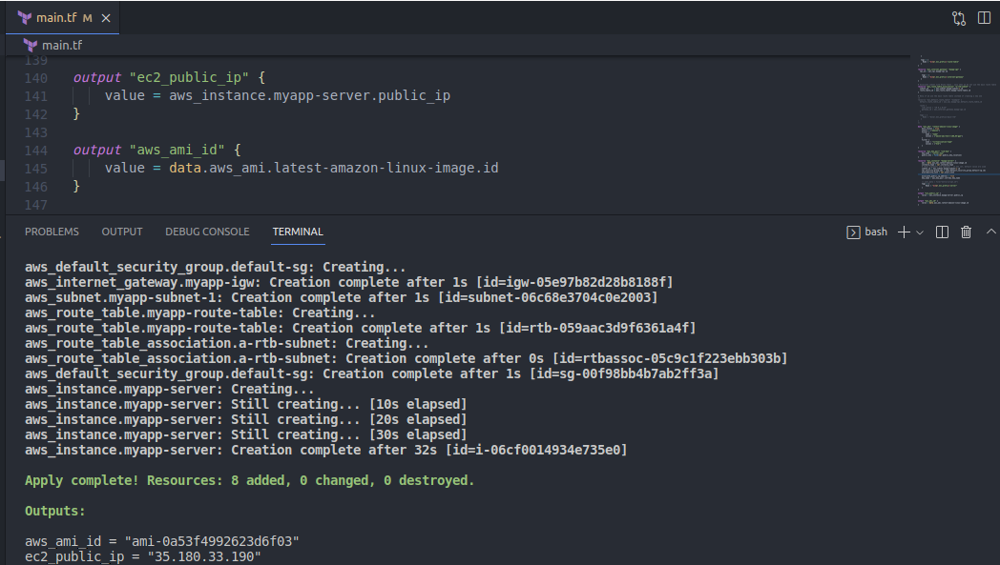
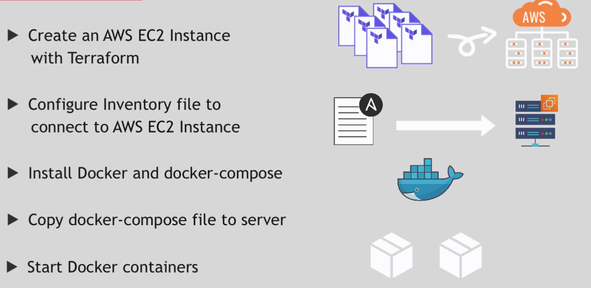
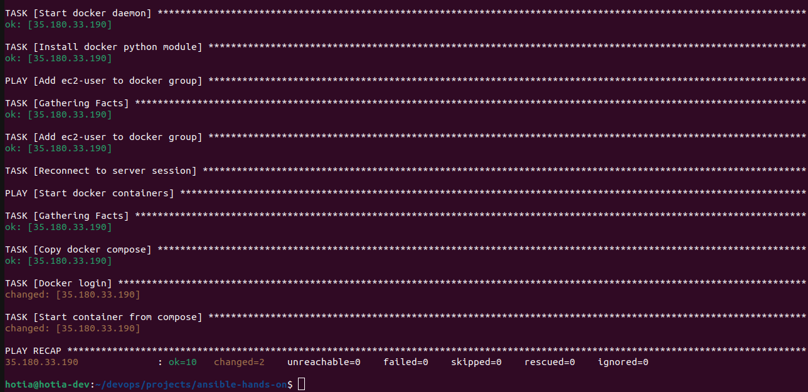
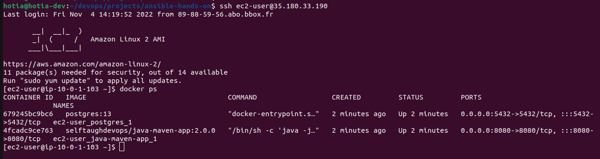

<br>

# Deploy docker containers via docker compose on EC2 server

## 1- Provision the EC2 instance 

I have already [Terraform configuration](https://github.com/hotiaDiallo/terraform-playground/tree/deploy-to-ec2) for server provisioning



## 2- Deploy containers



### Install python3, docker, docker-compose

EC2 instances use by default python2, so we will install python3 to to benefit from latest ansible modules

```
- name: Install python3, docker, docker-compose
  hosts: docker_server
  become: yes
  # become_user : root
  gather_facts: False # to fix issu with python3
  tasks:
    - name: Install python3 and docker
      vars:
        ansible_python_interpreter: /usr/bin/python
      ansible.builtin.yum: 
        name: 
          - python3
          - docker
        update_cache: yes
        state: present
    - name: Install Docker-compose
      ansible.builtin.get_url: 
        url: https://github.com/docker/compose/releases/download/1.27.4/docker-compose-Linux-{{lookup('pipe', 'uname -m')}}
        dest: /usr/local/bin/docker-compose
        mode: +x
    - name: Start docker daemon
      ansible.builtin.systemd:
        name: docker
        state: started
```
### Tell ansible to use python3 by default
add the following code ton `ansible.cfg` file 

```
interpreter_python = /usr/bin/python3
```
Now ansible will use python3 to execute tasks, but we do not have yet python3 when installing it, so we must tell ansible to use python2 ton install python3

Add this to your task

```
vars:
    ansible_python_interpreter: /usr/bin/python
```

So now we use `python3 interpreter` globally and switch to `python2` when 
- 1 Installing python 3
- 2 using yum to install packages 

### Create a user for docker

The best practice to run docker with a user with less privilegies instead of using root user. So we can create a `linux user` or use the default user on EC2 (`ec2-user`). 
- create a linux user

```
- name: create linux user and add to docker group
  hosts: docker_server
  become: yes
  vars_files:
    - rundocker-vars
  tasks: 
    - name: Create new linux user
      ansible.builtin.user:
        name: "{{linux_user}}"
        groups: "{{groups}}"
```

But for simplicity, we use the default user and add it to the docker group

```
- name: Add ec2-user to docker group
  hosts: docker_server
  become: yes
  tasks: 
    - name: Add ec2-user to docker group
      ansible.builtin.user: 
        name: ec2-user
        groups: docker
        append: yes
    # only then docker group will be add to groups
    - name: Reconnect to server session
      ansible.builtin.meta: reset_connection
```
### run docker containers using docker compose

- Set variable on a file `rundocker-vars`

```
groups: adm, docker
docker_compose_file: 
docker_hub_user: 
docker_hub_password:
```
- copy docker-compose file to the target server

Sample of docker-compose content : 

```
version: '3.9'
services:
    java-maven-app:
      image: selftaughdevops/java-maven-app:2.0.0
      ports:
        - 8080:8080
    postgres:
      image: postgres:13
      ports:
        - 5432:5432
      environment:
        - POSTGRES_PASSWORD=my-password
```

- docker login 
- start containers

```
- name: Start docker containers
  hosts: docker_server
  vars_files:
    - rundocker-vars
  tasks:
    - name: Copy docker compose
      ansible.builtin.copy:
        src: "{{docker_compose_file}}"
        dest: /home/ec2-user/docker-compose.yaml
    - name: Docker login
      community.docker.docker_login: 
        registry_url: https://index.docker.io/v1/
        username: "{{docker_hub_user}}"
        password: "{{docker_hub_password}}"
    - name: Start container from compose
      community.docker.docker_compose: 
        project_src: /home/ec2-user 
```

<br>



<br>


